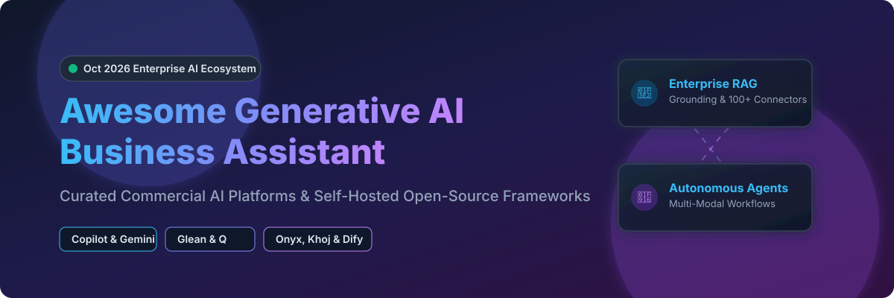

# Awesome-Generative-AI-Business-Assistant

# Awesome-Generative-AI-Business-Assistant 🤖 🏢



  





  
  
  
  
  
  



---

## 🌟 Top Generative AI Business Assistant Ecosystem

**Curated List of Commercial Enterprise AI Assistants & Open-Source Business AI Frameworks**  
*Focused on Enterprise Search, Knowledge Grounding, RAG Pipelines, Agentic Workflows, Data Connectors & Self-Hosted AI Assistants*

**Last updated: October 2026** 📅

---

### 📌 Overview & SEO Summary
Welcome to the ultimate curated directory of **generative AI business assistants**, **open-source enterprise AI frameworks**, and **knowledge grounding platforms**. Whether you are looking for enterprise-grade commercial solutions (such as *Amazon Q*, *Microsoft Copilot*, and *Glean*), or self-hostable open-source alternatives (like *Danswer/Onyx*, *Khoj*, and *Open WebUI*), this list covers category leaders, RAG pipelines, and privacy-respecting enterprise AI.

**Key Market Context:**
- **Microsoft Copilot** leads enterprise adoption with **deep Office integration** and **Microsoft Graph grounding** — priced at **$30/user/month**.
- **Glean** is the **most advanced enterprise AI assistant**, with **100+ connectors**, **knowledge graph**, and **agentic workflows** — used by **Databricks, Reddit, and Duolingo**.
- **Danswer (now Onyx)** is the **leading open-source enterprise AI assistant**, with **15K+ GitHub stars**, **40+ connectors**, and **self-hosted deployment** for full data sovereignty.

---

## 📑 Table of Contents
- [🏢 SaaS & Commercial Platforms](#-saas--commercial-platforms)
- [🔓 Open-Source GitHub Projects](#-open-source-github-projects)
- [🛠️ How to Contribute](#%EF%B8%8F-how-to-contribute)
- [📊 Star History](#-star-history)
- [🤝 Support & Sponsorship](#-support--sponsorship)
- [⚠️ Disclaimer](#%EF%B8%8F-disclaimer)

---

## 🏢 SaaS / Commercial Platforms

The generative AI business assistant market spans **hyperscaler productivity assistants** (Microsoft Copilot, Google Gemini Enterprise) that provide **deep integration with productivity suites**, **enterprise AI search platforms** (Glean, Amazon Q) that focus on **knowledge grounding across enterprise data**, and **specialized AI research and writing platforms** (Hebbia, Writer, Dust) that offer **domain-specific AI for finance, legal, and media**. **Microsoft Copilot** costs **$30/user/month** (annual commitment) . **Google Gemini Enterprise** is **$30/user/month** for Business Standard and above . **Amazon Q Business** charges **$20/user/month** for Business and **$25/user/month** for Enterprise . **Glean** uses **custom enterprise pricing** starting around **$50K/year** for 100 users . **ChatGPT Enterprise** costs **$60/user/month** with **unlimited GPT-4o**.

| SaaS / Commercial Platform | Company / Owner | Valuation / Market Cap | Standard Edition Starting Price | Free Tier / Free Trial Limits | Description |
| :--- | :--- | :--- | :--- | :--- | :--- |
| **[Amazon Q](https://aws.amazon.com/q/)** ☁️ | Amazon | ~$2.0 Trillion | **$20/user/month** (Business); **$25/user/month** (Enterprise)  | **Free tier: 30-day trial**  | **AWS-native GenAI assistant** — **40+ built-in connectors** for S3, SharePoint, Salesforce, Slack, and more . **RAG-based answers with citations** . **Enterprise access controls (IAM Identity Center)** . **Amazon Q Apps for no-code AI applications** . |
| **[Microsoft Copilot](https://www.microsoft.com/en-us/microsoft-365/copilot)** 🔷 | Microsoft | ~$3.90 Trillion | **$30/user/month** (annual commitment)  | **No free tier**; demo available | **Microsoft-native AI assistant** — **Integrated with Word, Excel, PowerPoint, Outlook, and Teams** . **Grounding in Microsoft Graph** . **Enterprise data protection** with **Copilot Copyright Commitment** . **Copilot Studio for custom agents** . |
| **[Glean](https://www.glean.com/)** 🎯 | Glean | ~$4.6 Billion | **Custom enterprise pricing** (from ~$50K/year for 100 users)  | **No free tier**; demo available | **Enterprise search and AI assistant** — **100+ connectors** for enterprise data . **Knowledge graph with permissions-aware search** . **Glean Assistant, Chat, and Agents** . **Used by Databricks, Reddit, Duolingo, and Canvas** . |
| **[Google Gemini Enterprise](https://workspace.google.com/solutions/ai/)** 🌐 | Google (Alphabet) | ~$2.0 Trillion | **$30/user/month** (Business Standard and above)  | **Free: limited Gemini features**  | **Google-native AI assistant** — **Integrated with Gmail, Docs, Sheets, Slides, and Meet** . **Gemini Enterprise** for advanced AI agents and workflows . **Grounding in Google Workspace data** . |
| **[Hebbia](https://www.hebbia.com/)** 🧠 | Hebbia | Private | **Custom enterprise pricing**  | **Demo available** | **AI research and analysis platform** — **Matrix** for **document-heavy workflows** in finance, legal, and media . **Multi-document analysis and synthesis** . |
| **[ChatGPT Enterprise](https://openai.com/chatgpt/enterprise/)** 🤖 | OpenAI | ~$80 Billion | **$60/user/month** (annual)  | **No free tier**; demo available | **Enterprise ChatGPT** — **Unlimited GPT-4o, GPT-4o mini, and o1 access** . **Enterprise-grade security and compliance** . **Admin console with SSO, SCIM, and domain verification** . **32K context window** and **data not used for training** . |
| **[Perplexity Enterprise Pro](https://www.perplexity.ai/enterprise)** 🔍 | Perplexity AI | ~$9 Billion | **$40/user/month**  | **Pro: $20/month per user**  | **AI-powered search assistant** — **Real-time web search with citations** . **Enterprise Pro adds data retention controls, SSO, and user management** . |
| **[Claude for Work](https://www.anthropic.com/claude)** 🟣 | Anthropic | ~$60 Billion | **$30/user/month** (Team)  | **Free: Claude.ai**  | **Anthropic's enterprise AI assistant** — **Claude 3.5 Sonnet and Opus models** . **200K context window** . **Projects and artifacts for team collaboration** . |
| **[Dust.tt](https://dust.tt/)** 🌟 | Dust | Private | **$29/user/month** (Pro)  | **Free: 14-day trial**  | **AI assistant platform for teams** — **Custom AI assistants grounded in company data** . **Connects to Slack, Notion, and Google Drive** . |
| **[Writer Enterprise](https://writer.com/)** ✍️ | Writer | ~$1.9 Billion | **Custom enterprise pricing**  | **Free: limited**  | **Enterprise AI writing and knowledge platform** — **Palmyra LLMs** for **business writing** . **AI Studio for custom agents** . **Grounding in company data with RAG** . |

---

## 🔓 Open-Source GitHub Projects

*Sorted by GitHub_Stars_Count (Descending)* 🌟

- **[Danswer (Onyx)](https://github.com/onyx-dot-app/onyx)**   
  **The leading open-source enterprise AI assistant**, MIT licensed. **15K+ GitHub stars** — **40+ connectors** for Slack, Google Drive, Confluence, Jira, Notion, and more . **RAG-based answers with citations** . **Custom assistants and agents** . **Self-hosted for full data sovereignty** . **The most comprehensive open-source enterprise AI platform** . 🏢

- **[Khoj](https://github.com/khoj-ai/khoj)**   
  **Your AI second brain**, AGPL-3.0 licensed. **28K+ GitHub stars** — **self-hosted AI assistant** that searches across **documents, notes, and the web** . **Supports local LLMs (Llama, Mistral) and cloud models (GPT-4, Claude)** . **WhatsApp, Emacs, Obsidian, and browser integration** . 🧠

- **[Open WebUI](https://github.com/open-webui/open-webui)**   
  **Self-hosted ChatGPT-style UI with RAG**, MIT licensed. **124K+ GitHub stars** — **supports Ollama, OpenAI-compatible APIs, MCP servers, and RAG with 9+ vector databases** . **Multi-user RBAC and LDAP/SSO** . **The most deployed self-hosted AI chat platform** . 🔒

- **[AnythingLLM](https://github.com/Mintplex-Labs/anything-llm)**   
  **All-in-one desktop and Docker AI application**, MIT licensed. **30K+ GitHub stars** — **RAG, AI agents, and multi-model support** . **Works with any LLM** . **Document ingestion with vector databases** . 📦

- **[Dify](https://github.com/langgenius/dify)**   
  **LLMOps platform with agentic workflows**, Apache-2.0 licensed. **40K+ GitHub stars** — **visual workflow builder combining LLM nodes, knowledge retrieval, tools, and conditional logic** . **Self-hosted or Dify Cloud** . 🎨

- **[PrivateGPT](https://github.com/zylon-ai/private-gpt)**   
  **Interact with your documents using local LLMs**, Apache-2.0 licensed. **55K+ GitHub stars** — **100% private** — no data leaves your environment . **RAG pipeline with local embeddings and LLMs** . 🔐

- **[Quivr](https://github.com/QuivrHQ/quivr)**   
  **Opinionated RAG for enterprise**, Apache-2.0 licensed. **38K+ GitHub stars** — **second brain for enterprise data** . **Multi-modal RAG with any LLM** . 🧩

- **[LibreChat](https://github.com/danny-avila/LibreChat)**   
  **Enhanced ChatGPT clone with multi-model support**, MIT licensed. **25K+ GitHub stars** — **supports OpenAI, Anthropic, Google, and local models** . **Agents, code interpreter, and file uploads** . 💬

- **[LocalAI](https://github.com/mudler/LocalAI)**   
  **OpenAI-compatible API for local inference**, MIT licensed. **30K+ GitHub stars** — **drop-in replacement for OpenAI API** . **Runs LLMs, image generation, and speech on consumer hardware** . 🖥️

- **[Continue](https://github.com/continuedev/continue)**   
  **Open-source IDE extensions for AI coding**, Apache-2.0 licensed. **20K+ GitHub stars** — **VS Code and JetBrains plugins** that connect to any LLM . 🔌

- **[RAGFlow](https://github.com/infiniflow/ragflow)**   
  **Open-source RAG engine based on deep document understanding**, Apache-2.0 licensed. **40K+ GitHub stars** — **template-based chunking and grounded citations** . 📄

- **[Dust.tt (Open Source)](https://github.com/dust-tt/dust)**   
  **Open-source AI assistant platform**, open-source. **Custom AI assistants grounded in company data** . **Connects to Slack, Notion, and Google Drive** . 🌟

---

## 🛠️ How to Contribute

Contributions are welcome! Follow these steps to submit new generative AI business assistant platforms or open-source enterprise AI software:

1. 🍴 **Fork** the repository.
2. 📝 **Add/edit** entries in `README.md` maintaining table/list structure and formatting.
3. 🔗 Include project title, official website/GitHub link, exact Stars_Count, license, and brief description.
4. 🚀 Submit a **Pull Request** with a descriptive summary of your changes.

---

## 📊 Star History



---

## 🤝 Support & Sponsorship

If you find this generative AI business assistant repository useful, please consider supporting the project:

- ⭐ **Star** this repository to increase visibility!
- 🔀 **Fork** and share with fellow AI engineers, enterprise architects, and open-source advocates.
- ☕ **Sponsor & Buy Me a Coffee**: Support ongoing open-source curation via the [GitHub Sponsor Dashboard](https://github.com/sponsors/ishandutta2007).

---

## ⚠️ Disclaimer

- This is a **community-curated** list — not exhaustive and not an endorsement. ℹ️
- **Microsoft Copilot costs $30/user/month** and **Google Gemini Enterprise costs $30/user/month** — both require annual commitments . **Amazon Q Business starts at $20/user/month** . **ChatGPT Enterprise costs $60/user/month** with unlimited GPT-4o access .
- **Danswer (Onyx) is the leading open-source enterprise AI assistant** with **15K+ GitHub stars**, **40+ connectors**, and **self-hosted deployment** for full data sovereignty . **Khoj provides a self-hosted AI second brain** with **28K+ GitHub stars** and **local LLM support** .
- **Open-source enterprise AI assistants are not turnkey** — they require **deployment, connector configuration, vector database setup, and ongoing maintenance** . **Danswer requires PostgreSQL, Redis, and a vector database** . **Khoj requires local or cloud LLM configuration** . **Always validate data access controls and answer accuracy with a proof-of-concept** before production deployment . 🤖

---



  <b>Made with ❤️ for AI engineers, enterprise architects, and open-source enterprise AI advocates.</b>

